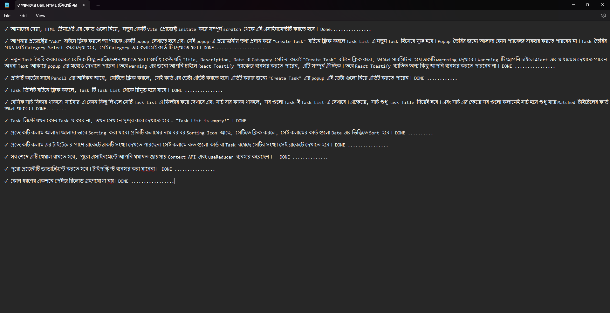

# Task Management App

This is a task management application built with Vite and React, featuring a task list with essential functionalities like task creation, editing, deletion, search, and sorting. It demonstrates effective use of React’s Context API and useReducer to manage application state without any page reloads.

## Features

1. **Task Creation with Popup**:

   - Clicking on the "Add" button opens a popup for task creation.
   - Tasks can be assigned a Title, Description, Date, and Category.
   - New tasks appear under the selected Category column.

2. **Validation**:

   - Fields like Title, Description, Date, and Category are required.
   - Warning messages appear if fields are left empty.
   - Optional: React Toastify is used for warnings.

3. **Task Editing**:

   - Each task has a Pencil icon, which allows for editing within the popup form.

4. **Task Deletion**:

   - Tasks can be deleted by clicking on the Delete button.

5. **Search Functionality**:

   - Search tasks by title. Search results filter across all columns.
   - If the search bar is empty, all tasks are displayed.

6. **Sorting by Date**:

   - Each column has a sorting icon that arranges tasks by date.

7. **Task Count Display**:

   - Each column header shows the number of tasks in that category.

8. **Empty Task List**:

   - Displays "Task List is empty!" if there are no tasks.

9. **State Management**:
   - Context API and useReducer manage the application state.

## Tech Stack

- **Frontend**: React, JavaScript, Vite
- **Validation**: Optional use of React Toastify for alerts

## How to Run

1. Clone the repository:
   ```bash
   git clone <repository-url>
   ```
